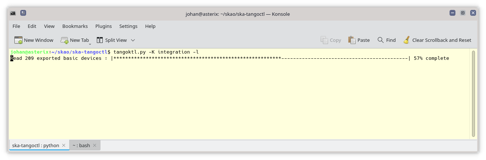

Tangoctl: a utility to query and test Tango devices
***************************************************

.. image:: https://readthedocs.org/projects/ska-telescope-ska-tangoctl/badge/?version=latest

Description
===========

Tangoctl reads information fields, attributes, command and property configuration and 
values of all Tango devices with a single command. The ouput format is configurable. It
can be called from bash or Python. It can be configured with a JSON file. Regular 
expression filtering of Tango entities is supported. Support for Tango devices running 
in a Kubernetes cluster is built in.

This repo provides a suite of utilities for use with Tango:

* **tangoctl**, a utility to query and test Tanfo devices
* **tangoktl**, a utility to query and test Tanfo devices running in a Kubernetes cluster

Getting started
===============

Clone this repo::

    $ git clone https://gitlab.com/ska-telescope/ska-tangoctl.git
    $ cd ska-tangoctl
    $ git submodule update --init --recursive

Build and view doumentation::

    $ make docs-build html
    $ firefox docs/build/html/index.html

Installation
============

Requirements
------------

Install the following:

* pytango 9.4.2 or higher

`Download Tango <https://pytango.readthedocs.io/en/latest/installation.html>`_

Docker container
----------------

Build a new Docker image for the project::

    $ make oci-build
    [...]
    [+] Building 111.7s (14/14) FINISHED
    [...]

Usage
=====

Here are some examples of using this package::

    $ tangoktl --namespace=integration --show-dev
    $ tangoktl --namespace=integration -D talon -l
    $ tangoktl --namespace=integration -A timeout
    $ tangoktl --namespace=integration -C Telescope
    $ tangoktl --namespace=integration -P Power
    $ tangoktl --namespace=integration -D mid_csp_cbf/talon_lru/001 -f
    $ tangoktl --namespace=integration -D mid_csp_cbf/talon_lru/001 -s
    $ tangoktl --namespace=integration -D mid_csp_cbf/talon_lru/001 -q
    $ tangoktl --namespace=integration -D mid_csp_cbf/talon_board/001 -f
    $ tangoktl --namespace=integration -D mid_csp_cbf/talon_board/001 -f --dry-run
    $ ADMIN_MODE=1 tangoctl --k8s-ns=integration -D mid_csp_cbf/talon_board/001 -f --in resources/dev_online.json -V

Support
=======

Go to this `Slack group <https://skao.slack.com/archives/C023L1N3H60>`_ for help:

Roadmap
=======

This is the alpha release. New releases will be made available for new features or bug fixes.

Contributing
============

This project is open to contributions, see:

https://developer.skatelescope.org/en/latest/getting-started/contrib-guidelines.html

Use these commands to lint the code or run tests::

    $ make python-lint
    $ make python-test

Authors and acknowledgment
==========================

Team Atlas, SARAO

License
=======

Copyright 2020 SKA Observatory

Redistribution and use in source and binary forms, with or without modification, are permitted provided that the following conditions are met:

1. Redistributions of source code must retain the above copyright notice, this list of conditions and the following disclaimer.
2. Redistributions in binary form must reproduce the above copyright notice, this list of conditions and the following disclaimer in the documentation and/or other materials provided with the distribution.
3. Neither the name of the copyright holder nor the names of its contributors may be used to endorse or promote products derived from this software without specific prior written permission.

THIS SOFTWARE IS PROVIDED BY THE COPYRIGHT HOLDERS AND CONTRIBUTORS "AS IS" AND ANY EXPRESS OR IMPLIED WARRANTIES, INCLUDING, BUT NOT LIMITED TO, THE IMPLIED WARRANTIES OF MERCHANTABILITY AND FITNESS FOR A PARTICULAR PURPOSE ARE DISCLAIMED. IN NO EVENT SHALL THE COPYRIGHT HOLDER OR CONTRIBUTORS BE LIABLE FOR ANY DIRECT, INDIRECT, INCIDENTAL, SPECIAL, EXEMPLARY, OR CONSEQUENTIAL DAMAGES (INCLUDING, BUT NOT LIMITED TO, PROCUREMENT OF SUBSTITUTE GOODS OR SERVICES; LOSS OF USE, DATA, OR PROFITS; OR BUSINESS INTERRUPTION) HOWEVER CAUSED AND ON ANY THEORY OF LIABILITY, WHETHER IN CONTRACT, STRICT LIABILITY, OR TORT (INCLUDING NEGLIGENCE OR OTHERWISE) ARISING IN ANY WAY OUT OF THE USE OF THIS SOFTWARE, EVEN IF ADVISED OF THE POSSIBILITY OF SUCH DAMAGE.

Project status
==============

This project is under active development. This is an alpha release.

.. image:: img/logo.webp
